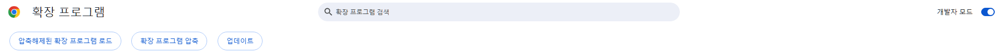

# 엘리스 강의실 자동 재참여 크롬 확장자

강사님이 중요한 말 할 때 튕기는걸 3연속으로 당해, 기분이 몹시 서운해져서 만든 크롬 확장 프로그램

## 기본 동작

1. 주기적으로(매 0.5초) '라이브 강의실 참여하기' 버튼이 생기는지 추적
2. 버튼 감지시 자동 재진입
3. 사용자가 수동으로 퇴장/진입 시 자동참여로직이 비활성화/활성화 됨
4. 자동 재입장 옵션 추가 

   

## 확장 프로그램 추가 방법

**크롬 기준**

1. `브라우저 설정 > 확장프로그램 관리` 이동
   
2. `개발자 모드` 활성화
   
3. `압축해제된 확장 프로그램 로드` 후 해당 소스가 있는 폴더 선택
4. 확장프로그램 로드 후 사이트 새로고침
5. (선택사항) 타 사이트에서 오동작 방지 위해 사이트 권한 설정
   

## 문제점

~~강의실 퇴장을 원할 경우 '사이트 권한 설정'을 **확장 프로그램을 클릭할 경우로** 변경 해야 재진입 동작이 멈추는 불편함이 있음~~ `0.1.0` 이후 해결 됨

## TODO

- [ ] 채팅창에 채팅이 동기화 안되는 문제를 해결하기 위한 동작 추가 - 크롬 외 브라우저에서 동기화 안되는것 확인
- [x] 자동 재진입 동작 활성화/비활성화 기능 추가

## Contribute 
@do-ong22 자동입장 로직 사용성 개선 기여
